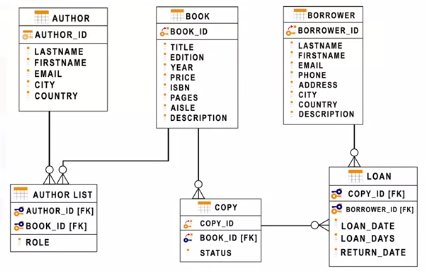

# Week02

---

## Relational Database Concepts

We will learn how we use the models to map data to tables, and define the relationships between tables.

### At the end of this lesson, you will be able to:

- explain the advantage of the relational model
- explain how the entity name and attributes map to a relational database table
- describe the difference between an entity and an attribute
- identify some commonly used data types
- describe the function of primary keys.

### Relational Model

- Most used data model
- allows for data indenpendance
- data is stored in tables

### Entity-Relationship Model

- Entity relationship data model (ER data model)
- ERD - Entity relationship disgram
    
    
    
- Used as a tool to design relational databases


- The buiding blocks of an ER diagram are entities and attributes.
    - Entity should be draw as a rectangle in ERD
    - Attributes are draw as ovals (tell as more about the entity)
    - E.g. Entity: BOOK, Attributes: TITLE, EDITION, etc.

### Mapping Entity Diagrams to Tables

- Entities become tables, Attributes get translated into columns


### Primary Keys and Foreign Keys


- Primary keys: The primary keys of a relational table uniquely identifies each tuple or row in a table.
- Foreign Keys: The foreign keys are primary keys defined in other tables, which create a link between the tables.

## How to create a Database instance on Cloud

### At the end of this lesson, you will be able to:

- cloud database basics
- list some cloud databases
- describe a database instance
- create an instance of IBM Db2 on cloud

### Cloud databases


### Examples of cloud databases


### Databases service instances


### IBM Db2 on Cloud

- IBM Db2 on Cloud is a SQL database provisioned for you in the Cloud.

## Types of SQL statements (DDL vs. DML)

- SQL Statements are used for interacting with Entities (that is, tables), Attributes (that is, columns) and their tuples (or rows with data values) in relational databases.
- DDL - data definition language statements
    - Data Definition Language (**DDL**) statements are used to **define**, **change**, or **drop** database objects such as tables. Common DDL statement types include `CREATE`, `ALTER`, `TRUNCATE`, and `DROP`.
    - `CREATE`: which is used for creating tables and defining its columns
    - `ALTER`: is used for altering tables including adding and dropping columns and modifying their datatypes
    - `TRUNCATE`: is used for deleting data in a table but not the table itself
    - `DROP`: is used for deleting tables
- DML - data manipulation language statements
    - Data Manipulation Language (**DML**) statements are used to **read** and **modify** data in tables. These are also sometimes referred to as **CRUD operations**, that is, Create, Read, Update and Delete rows in a table. Common DML statement types include `INSERT`, `SELECT`, `UPDATE`, and `DELETE`.
    - `INSERT`: is used for inserting a row or several rows of data into a table
    - `SELECT`: reads or selects row or rows from a table
    - `UPDATE`: edits row or rows in a table
    - `DELETE`: removes a row or rows of data from a table
- Summation
    - DDL or Data Definition Language statements are used for defining or changing objects in a database such as tables.
    - DML or Data Manipulation Language statements are used for manipulating or working with data in tables.

## CREATE TABLE Statement

create syntax should be like below:

```sql
CREATE TABLE table_name
(
column_name_1 datatype optional_parameters,
column_name_2 datatype,
...
column_name_n datatype
)
```

### Example - Create a table for Canadian Provinces

`CHAR`: a character string of a fixed length

`VARCHAR`: a character string of a variable length

```sql
CREATE TABLE provinces(
	id char(2) PRIMARY KEY NOT NULL,
	name varchar(24)
)
```

### Example - Library database


- `PRIMARY KEY`: Uniquely Identifies each Row in a Table
- `NOT NULL`: prevent contain null value

```sql
CREATE TABLE author(
	author_id CHAR(2) PRIMARY KEY NOT NULL,
	lastname VARCHAR(15) NOT NULL,
	firstname VARCHAR(15) NOT NULL,
	email VARCHAR(40),
	city VARCHAR(15),
	country VARCHAR(2),
)
```

## ALTER, DROP, and Truncate tables

- `ALTER` is used for:
    - add or remove columns
    - modify the data type of columns
    - add or remove keys
    - add or remove constrains
- The syntax of the `ALTER TABLE` statement table is shown:

```sql
ALTER TABLE <table_name_1>
	ADD COLUMN <column_name_1> datatype
	...
	ADD COLUMN <column_name_n> datatype;
```

### Example - Add a telephone number in a table


### ALTER TABLE … ADD COLUMN

- BIGINT: a datatype for an column up to 19 digits long

```sql
ALTER TABLE author
	ADD COLUMN telephone_number BIGINT;
```


### Example - modify the datatype of a column

```sql
ALTER TABLE <table_name>
	ALTER COLUMN <column_name> SET DATA TYPE;
<datatype>;

```

### ALTER TABLE … ALTER COLUMN

```sql
ALTER TABLE author
	ALTER COLUMN telephone_number SET DATA TYPE;
CHAR(20);
```


### ALTER TABLE … DROP COLUMN

```sql
ALTER TABLE author
	DROP COLUMN telephone_number SET DATA TYPE;
```


### DROP TABLE


### TRUNCATE TABLE

`TRUNCATE TABLE` statement is used to delete all the rows in a table

```sql
TRUNCATE TABLE <table_name>
	IMMEDIATE;
```


## **Summary & Highlights**

After completion of this lesson, you should know:

- A database is a repository of data that provides functionality for adding, modifying, and querying the data.
- SQL is a language used to query or retrieve data from a relational database.
- The Relational Model is the most used data model for databases because it allows for data independence.
- The primary key of a relational table uniquely identifies each tuple or row, preventing duplication of data and providing a way of defining relationships between tables.
- SQL statements fall into two different categories: Data Definition Language (DDL) statements and Data Manipulation Language (DML) statements.

## Labs

[Lab_01_**CREATE, ALTER, TRUNCATE, DROP into Tables in MySQL using phpMyAdmin**](Week02/Lab_01_CREATE,%20ALTER,%20TRUNCATE,%20DROP%20into%20Tables%20i%2029c576a2e3c1409ca75822d644dadb30.md)

[**Lab_02_Create Tables using SQL Scripts and Load Data into Tables in MySQL using phpMyAdmin**](Week02/Lab_02_Create%20Tables%20using%20SQL%20Scripts%20and%20Load%20Da%20b159f8f09ec444da8c0a5bf705d41447.md)

- Useless Labs
    
    [Lab_01_**Create Db2 service instance and Get started with the Db2 console**](Week02/Lab_01_Create%20Db2%20service%20instance%20and%20Get%20started%20219f9cb647d84effa7fadc975c1bdeaa.md)
    
    [Lab_02_****Examples to CREATE and DROP tables****](Week02/Lab_02_Examples%20to%20CREATE%20and%20DROP%20tables%20cccb97a63ec641068593eb295f0ffcb6.md)
    
    [Lab_03_****CREATE, ALTER, TRUNCATE, DROP****](Week02/Lab_03_CREATE,%20ALTER,%20TRUNCATE,%20DROP%2076d7582a377847f1a21f32113b155e38.md)
    
    [Lab_04_****Create Tables using SQL Scripts and Load Data into Tables****](Week02/Lab_04_Create%20Tables%20using%20SQL%20Scripts%20and%20Load%20Da%20960ab30f0e634139b9f070ea203a2d57.md)
    
    [Lab_05_SQL Cheat Sheet: CREATE TABLE, ALTER, DROP, TRUNCATE](Week02/Lab_05_SQL%20Cheat%20Sheet%20CREATE%20TABLE,%20ALTER,%20DROP,%20%20684d46b20e8740eaaa28ac18df70bef6.md)
    

## Practice Quiz


## Graded Quiz: Relational DB Concepts and Tables

